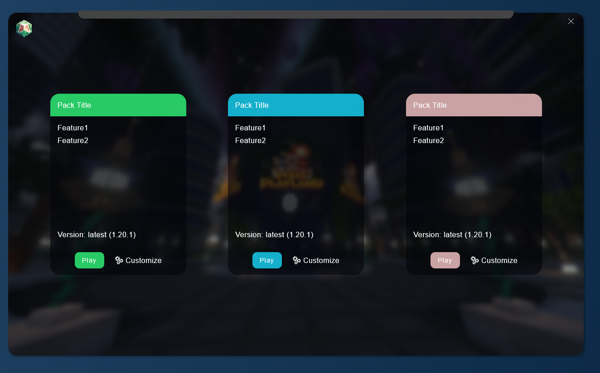

<!-- PROJECT LOGO -->
 

<h3 align="center">SageLauncher</h3>

  

  

    An open source custom modded minecraft launcher
     
     
    <a href="https://github.com/CoasterFreakDE/SageLauncher/issues">Report Bug</a>
    ·
    <a href="https://github.com/CoasterFreakDE/SageLauncher/issues">Request Feature</a>
  

## Installation

1. Download the latest release for your system from [here](https://github.com/CoasterFreakDE/SageLauncher/releases)
2. Run the package/executable

## Features

- 🧪 Custom chosen Sagepacks - modpacks to enhance your vanilla experience
- ⚒️ **Customize every single mod** (add more or remove unnessesary)
- 🎛️ Microsoft login (OAuth 2.0) for multiple accounts (+ switch between them)
- 🍵 Easy to use
- ♻️ Automatic updates
- 🔎 **Open source**
- 🔒 No tracking or data collection
- 🪵 **Always up-to-date thanks to the [@modrinth](https://modrinth.com/) API**

## Preview (WIP)

